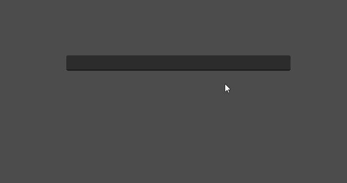

# line-edit-complete-godot
Custom Node in the godot engine. Configurable with a LineEdit to create an auto-complete menu.

## How to Use
1. Add the AutoCompleteAssistant node to your scene.
2. Select a Menu Location Control Node 
3. Add lineEdit nodes to the "line_edits" array
4. Give completion terms to the node either via the terms array (does not work on runtime for that use the load_terms method), or via a path to a json file
5. Now the menu should automatically be created and shown once you click on the lineEdit in a running scene

If you have any feedback or found bugs please contact me via github or my e-mail.
